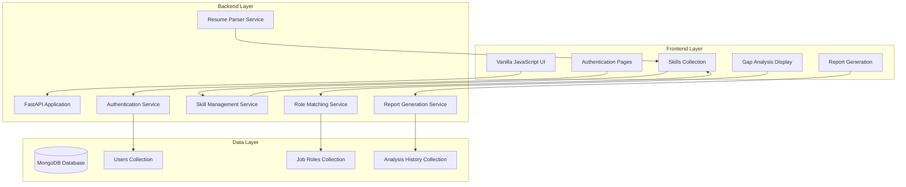

# Design Document

## Overview

The Skill Gap Analyzer is a full-stack web application built with FastAPI backend, vanilla JavaScript frontend, and MongoDB database. The system analyzes user skills against job role requirements to provide personalized career guidance and skill gap identification.

The architecture follows a three-tier design with clear separation between presentation (vanilla JS frontend), business logic (FastAPI backend), and data persistence (MongoDB). The system emphasizes security through JWT authentication, data integrity through validation layers, and user experience through intuitive interfaces.

## Architecture



The system uses a RESTful API design with clear endpoint separation for different functional areas. Authentication is handled through JWT tokens with secure password hashing using bcrypt.

## Components and Interfaces

### Frontend Components

**Authentication Module**
- Login/Signup forms with client-side validation
- JWT token management and storage
- Session handling and automatic logout
- Password strength validation

**Skill Management Interface**
- Searchable dropdown for skill selection from dataset
- Multi-select functionality with visual feedback
- Custom skill addition capability
- Skill source tracking (manual vs extracted)

**Resume Upload Component**
- File upload with format validation (PDF, DOCX, TXT)
- Progress indicators during parsing
- Extracted skill review and editing interface
- Error handling for parsing failures

**Analysis Dashboard**
- Role matching results with percentage scores
- Star rating visualization (1-5 stars)
- Skill gap categorization and grouping
- Role override functionality with dropdown selection

**Report Generation Interface**
- Export options (PDF, TXT, CSV formats)
- Report preview functionality
- Download management

### Backend Services

**Authentication Service**
```python
class AuthService:
    def register_user(email: str, password: str, name: str) -> UserModel
    def authenticate_user(email: str, password: str) -> TokenResponse
    def verify_token(token: str) -> UserModel
    def refresh_token(refresh_token: str) -> TokenResponse
```

**Skill Management Service**
```python
class SkillService:
    def get_skill_dataset() -> List[SkillModel]
    def add_user_skills(user_id: str, skills: List[str], source: str) -> bool
    def validate_and_normalize_skills(skills: List[str]) -> List[str]
    def get_user_skills(user_id: str) -> List[UserSkillModel]
```

**Resume Parser Service**
```python
class ResumeParserService:
    def parse_pdf(file_path: str) -> ParsedResumeModel
    def parse_docx(file_path: str) -> ParsedResumeModel
    def parse_txt(file_path: str) -> ParsedResumeModel
    def extract_skills_from_text(text: str) -> List[str]
    def detect_experience_level(text: str) -> ExperienceLevel
```

**Role Matching Service**
```python
class RoleMatchingService:
    def calculate_role_matches(user_skills: List[str]) -> List[RoleMatchModel]
    def calculate_skill_importance(skill: str, roles: List[RoleModel]) -> float
    def get_skill_gaps(user_skills: List[str], target_role: str) -> SkillGapModel
    def categorize_missing_skills(missing_skills: List[str]) -> Dict[str, List[str]]
```

### API Endpoints

**Authentication Endpoints**
- `POST /auth/register` - User registration
- `POST /auth/login` - User authentication
- `POST /auth/refresh` - Token refresh
- `GET /auth/profile` - Get user profile
- `PUT /auth/profile` - Update user profile

**Skill Management Endpoints**
- `GET /skills/dataset` - Get complete skill dataset
- `POST /skills/manual` - Add skills manually
- `GET /skills/user/{user_id}` - Get user skills
- `DELETE /skills/user/{user_id}/{skill_id}` - Remove user skill

**Resume Processing Endpoints**
- `POST /resume/upload` - Upload and parse resume
- `GET /resume/extracted/{user_id}` - Get extracted skills
- `PUT /resume/validate` - Validate and update extracted skills

**Analysis Endpoints**
- `GET /analysis/matches/{user_id}` - Get role matches
- `GET /analysis/gaps/{user_id}/{role_id}` - Get skill gaps for specific role
- `POST /analysis/override` - Analyze different role

**Report Endpoints**
- `GET /reports/gap/{user_id}` - Generate gap analysis report
- `GET /reports/skills/{user_id}` - Export user skills
- `GET /reports/missing/{user_id}/{role_id}` - Export missing skills

## Data Models

### User Model
```python
class UserModel:
    id: ObjectId
    email: str
    password_hash: str
    name: str
    created_at: datetime
    updated_at: datetime
    resume_path: Optional[str]
    experience_level: Optional[ExperienceLevel]
```

### Skill Model
```python
class SkillModel:
    id: ObjectId
    name: str
    category: str
    aliases: List[str]
    is_technical: bool
```

### User Skill Model
```python
class UserSkillModel:
    id: ObjectId
    user_id: ObjectId
    skill_name: str
    source: SkillSource  # MANUAL, RESUME_EXTRACTED
    confidence: float
    added_at: datetime
```

### Job Role Model
```python
class JobRoleModel:
    id: ObjectId
    title: str
    company: str
    required_skills: List[str]
    preferred_skills: List[str]
    experience_level: ExperienceLevel
    category: str
```

### Analysis Model
```python
class AnalysisModel:
    id: ObjectId
    user_id: ObjectId
    role_matches: List[RoleMatchModel]
    skill_gaps: Dict[str, SkillGapModel]
    analysis_date: datetime
    
class RoleMatchModel:
    role_id: ObjectId
    match_percentage: float
    essential_match_percentage: float
    star_rating: int
    missing_skills: List[str]
    matched_skills: List[str]
```

### MongoDB Collections Structure

**users collection**
- Stores user authentication and profile data
- Indexes: email (unique), created_at

**skills collection**
- Master dataset of all available skills
- Indexes: name (unique), category

**user_skills collection**
- Junction table for user-skill relationships
- Indexes: user_id, skill_name, source

**job_roles collection**
- Dataset of job roles and their skill requirements
- Indexes: title, category, experience_level

**analyses collection**
- Historical analysis results for users
- Indexes: user_id, analysis_date

## Correctness Properties

*A property is a characteristic or behavior that should hold true across all valid executions of a system-essentially, a formal statement about what the system should do. Properties serve as the bridge between human-readable specifications and machine-verifiable correctness guarantees.*

### Property 1: User Authentication Security
*For any* user registration with valid credentials, the system should create a user account with securely hashed passwords that are never stored in plain text, and successful authentication should generate valid JWT tokens
**Validates: Requirements 1.1, 1.2, 1.5**

### Property 2: Authentication Error Handling
*For any* invalid login credentials or expired JWT tokens, the system should reject authentication attempts and return appropriate error messages
**Validates: Requirements 1.3, 1.4**

### Property 3: Profile Data Integrity
*For any* user profile access or update, the system should maintain complete profile information including name, email, stored skills, and proper timestamps while preserving data integrity
**Validates: Requirements 2.1, 2.2, 2.5**

### Property 4: Resume File Handling
*For any* resume upload, the system should store the file path in the user profile and support PDF, DOCX, and TXT formats while rejecting unsupported formats
**Validates: Requirements 2.3, 5.1**

### Property 5: Skill Source Tracking
*For any* skill entry (manual or extracted), the system should persist skills with proper source tracking (manual entry vs resume extraction) in MongoDB
**Validates: Requirements 2.4, 4.6, 13.2**

### Property 6: Skill Dataset Integration
*For any* skill entry interface, the searchable dropdown should contain all skills from the dataset and support filtering based on user queries
**Validates: Requirements 4.1, 4.2**

### Property 7: Multi-Select Skill Management
*For any* skill selection or removal operation, the system should properly track selected skills, support multi-select functionality, and allow removal of selected skills
**Validates: Requirements 4.3, 4.5**

### Property 8: Custom Skill Addition
*For any* skill not in the dataset, the system should allow users to add custom skills and store them properly
**Validates: Requirements 4.4**

### Property 9: Resume Parsing Accuracy
*For any* resume parsing operation, the parser should extract skills only from "Skills" or "Technical Skills" sections and identify experience keywords (Internship, Training, Full-time, Project)
**Validates: Requirements 5.2, 5.3**

### Property 10: Skill Validation and Filtering
*For any* extracted skills, the system should filter them against the skill dataset and present them for user validation and editing
**Validates: Requirements 5.4, 5.5**

### Property 11: Parsing Error Handling
*For any* resume parsing failure or when no skills are found, the system should provide clear feedback and fallback to manual entry
**Validates: Requirements 5.6**

### Property 12: Skill Normalization and Deduplication
*For any* skill processing operation, the system should remove duplicates, normalize skill names using standard mappings (js → javascript), and maintain consistent naming conventions
**Validates: Requirements 6.1, 6.2, 6.5**

### Property 13: Skill Review Interface
*For any* skill validation completion, the system should provide a user interface for reviewing and removing incorrect skills, and allow manual addition of missing skills
**Validates: Requirements 6.3, 6.4**

### Property 14: Experience Level Detection and Weighting
*For any* resume analysis, the system should detect experience level indicators and use this information to weight role recommendations appropriately, storing experience data in the user profile
**Validates: Requirements 7.1, 7.2, 7.3, 7.4**

### Property 15: Comprehensive Role Matching
*For any* role matching request, the system should compare user skills against all roles in the dataset and return the top 5 most suitable roles ranked by match percentage
**Validates: Requirements 8.1, 8.3**

### Property 16: Match Calculation Accuracy
*For any* role matching calculation, the system should compute both essential skill matches and overall skill matches, presenting results with appropriate star ratings (1-5 stars)
**Validates: Requirements 8.2, 8.4, 8.5**

### Property 17: Skill Importance Analysis
*For any* skill analysis, the system should identify common company skills appearing across many roles and role-specific booster skills unique to particular roles using TF-IDF style analysis
**Validates: Requirements 9.1, 9.2, 9.3, 9.4**

### Property 18: Skill Gap Categorization
*For any* skill gap display, the system should group missing skills by categories (Programming, DevOps, ML, etc.) in an organized format
**Validates: Requirements 10.1**

### Property 19: Role Override Functionality
*For any* role selection override, the system should provide dropdown selection, perform instant gap analysis for the selected role, maintain analysis quality, and allow analysis of any role regardless of match percentage
**Validates: Requirements 11.1, 11.2, 11.3, 11.4**

### Property 20: Report Generation Completeness
*For any* report generation request, the system should create skill gap reports in TXT and PDF formats, generate CSV files for missing skills, create downloadable matched skills lists, and ensure all exports contain accurate, up-to-date data
**Validates: Requirements 12.1, 12.2, 12.3, 12.4**

### Property 21: Database Operations Integrity
*For any* database operation, the system should maintain data consistency and integrity across all MongoDB collections, properly store analysis history, and maintain the skill dataset
**Validates: Requirements 13.1, 13.3, 13.4, 13.5**

## Error Handling

The system implements comprehensive error handling across all layers:

**Authentication Errors**
- Invalid credentials return 401 Unauthorized with descriptive messages
- Expired tokens trigger automatic logout and redirect to login
- Registration conflicts (duplicate email) return 409 Conflict
- Password validation errors provide specific feedback

**File Processing Errors**
- Unsupported file formats return 400 Bad Request with supported format list
- File size limits enforced with clear error messages
- Parsing failures gracefully fallback to manual skill entry
- Corrupted files handled with appropriate error responses

**Database Errors**
- Connection failures implement retry logic with exponential backoff
- Validation errors return 422 Unprocessable Entity with field-specific messages
- Constraint violations handled with user-friendly error messages
- Transaction failures implement rollback mechanisms

**API Errors**
- Rate limiting implemented with 429 Too Many Requests responses
- Input validation errors provide detailed field-level feedback
- Server errors (500) logged with correlation IDs for debugging
- Network timeouts handled with appropriate retry mechanisms

## Testing Strategy

The testing strategy employs a dual approach combining unit tests for specific scenarios and property-based tests for comprehensive validation:

**Unit Testing Focus**
- Authentication flow edge cases (expired tokens, invalid formats)
- File parsing error conditions (corrupted files, unsupported formats)
- Database connection failures and recovery
- API endpoint error responses
- Specific skill normalization mappings (js → javascript)

**Property-Based Testing Configuration**
- Using Hypothesis library for Python property-based testing
- Minimum 100 iterations per property test for statistical confidence
- Each property test tagged with feature name and property reference
- Custom generators for user data, skills, and resume content
- Comprehensive input space coverage through randomization

**Integration Testing**
- End-to-end user workflows (registration → skill entry → analysis → reports)
- Database transaction integrity across service boundaries
- File upload and processing pipeline validation
- JWT token lifecycle management

**Performance Testing**
- Role matching algorithm performance with large datasets
- Database query optimization validation
- File parsing performance with various document sizes
- Concurrent user session handling

The testing framework ensures both correctness through property validation and reliability through comprehensive error scenario coverage. Each correctness property maps directly to specific requirements, providing traceability from business needs to automated validation.